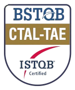

# Como vai? Bem-vindo(a)! 👋
### Me chamo Roberto 

- 👨‍💻 Trabalho como QA para a Smiles/GOL e, nos meus horários livres, estudo ou crio projetos por hobby.
- 📌 Um desses projetos criados por hobby é este blog: https://devonfire.blog
- 📚 Tenho conhecimentos e habilidades em Python, C, Java, automação e desenvolvimento web (JS, HTML, CSS). Além disso, possuo algum conhecimento em Shellscript, Powershell e Batchscript.
- 📌 Como QA, estou na área desde 2021, estou certificado no ISTQB (CTFL - Certified Tester Foundation Level) e buscando atualmente o CTAL-TAE.

 

-------------------------------------------------------------------------

   
 

-------------------------------------------------------------------------

**📝 Confira também os artigos recentes que venho escrevendo no Medium:**

<a target="_blank" href="https://github-readme-medium-recent-article.vercel.app/medium/@robsings_qadev/0">  
<a target="_blank" href="https://github-readme-medium-recent-article.vercel.app/medium/@robsings_qadev/1">  
<a target="_blank" href="https://github-readme-medium-recent-article.vercel.app/medium/@robsings_qadev/2">   

